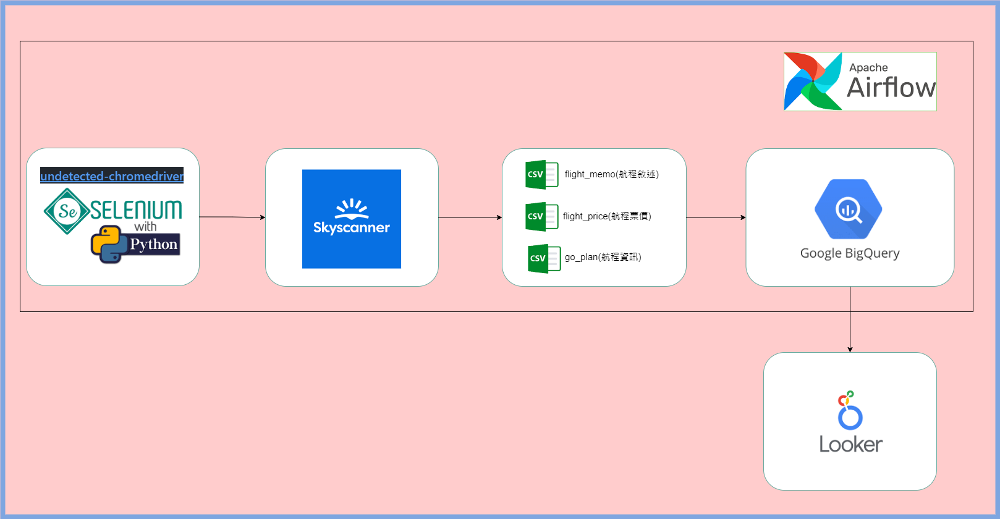
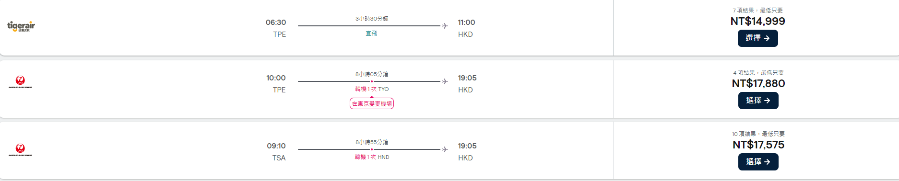

# 一、專題摘要
1. 專題主題 : Skyscanner網站爬蟲
2. 目標:
   * 獲得從臺灣->日本涵館的航班資訊，例如出發/抵達時間、飛行時間、價格、轉機地點/次數、航空公司...等資訊
   * 爬取的資訊寫入csv檔，再導入bigquery
   * 利用Airflow建立排程，完成前2項工作
   * 利用looker將儲存在bigquery的資料，進行資料視覺化
# 二、流程圖:

# 三、程式說明:
序號|路徑|程式名稱|功能敘述
|:---|:----|:----|:----|
1|dags/|skyscanner_tpet_hkd_v_1_0_0_dag.py|1.Airflow的排程程式，共有3個Task: a. calculate_future_date_task:依據執行日期+30日，並搭配xcom作為後續爬蟲的日期參數 b. web_scrab:使用Bash的方式呼叫web_scrap.sh程式。 c. date_bigquery:使用Bash的方式呼叫bigquery_insert_data.sh程式
2|dags/project/scanner_webscrap/|web_scrap.sh|呼叫爬蟲主程式，必需提供的參數分別為 出發地、抵達地、出發日期
3|dags/project/scanner_webscrap/|web_scrap.py|呼叫main_skyscanner_scrapper.py，進行爬取相關資訊
4|dags/project/scanner_webscrap/tools/|main_skyscanner_scrapper.py|1.爬取資訊的主要程式 2.分成去程&去程+回程的版本 3.預設:搭機人數為1人、僅查詢去程資訊
5|dags/project/scanner_webscrap/|bigquery_insert_data.sh|呼叫資料導入bigquery程式
6|dags/project/scanner_webscrap/|bigquery_insert_data.py|讀取/date目錄中的csv檔，呼叫data_importer.py，分別將最新的檔案導入bigquery
7|dags/project/scanner_webscrap/tools/|data_importer.py|1.建立bigquery連線 2.讀取預先建立好的schema(bigquery_config.py) 3.導入資料
# 四、背景資訊、程式開發流程、過程(遇到的問題&解決措施):
1. Skyscanner網站背景資訊:
   * url結構:
     - 去程: https://www.skyscanner.com.tw/transport/flights/出發地/目的地/出發日期/?成人人數
       - 例如: https://www.skyscanner.com.tw/transport/flights/tpet/hkd/230807/?adultsv2=1
     - 去程+回程: https://www.skyscanner.com.tw/transport/flights/出發地/抵達地/出發日期/回程日期/?成人人數
       - 例如: https://www.skyscanner.com.tw/transport/flights/tpet/hkd/230811/230914/?adultsv2=1
     - 還有其他參數，例如艙等、小孩人數等。這邊只用了出發地、目的地、出發日期、人數等資訊。
   * 欲爬取的目標資訊:
     
2. 流程:
   * 透過undected-selenium的方式並依據url的結構進行爬蟲:
     - https://www.skyscanner.com.tw/transport/flights/tpet/hkd/{date}/?adultsv2=1
   * 將爬取到的資訊儲存至csv檔案:
     - 航班敘述
     - 航程票價
     - 航程資訊
   * 爬取的資訊都存成csv檔案後，再把資訊導入bigquery
     - skyscannerweb.pdata.flight_memo
     - skyscannerweb.pdata.flight_price
     - skyscannerweb.pdata.flight_go_plan
3. 開發過程(遇到的問題&解決措施):
   * .....
    
    
